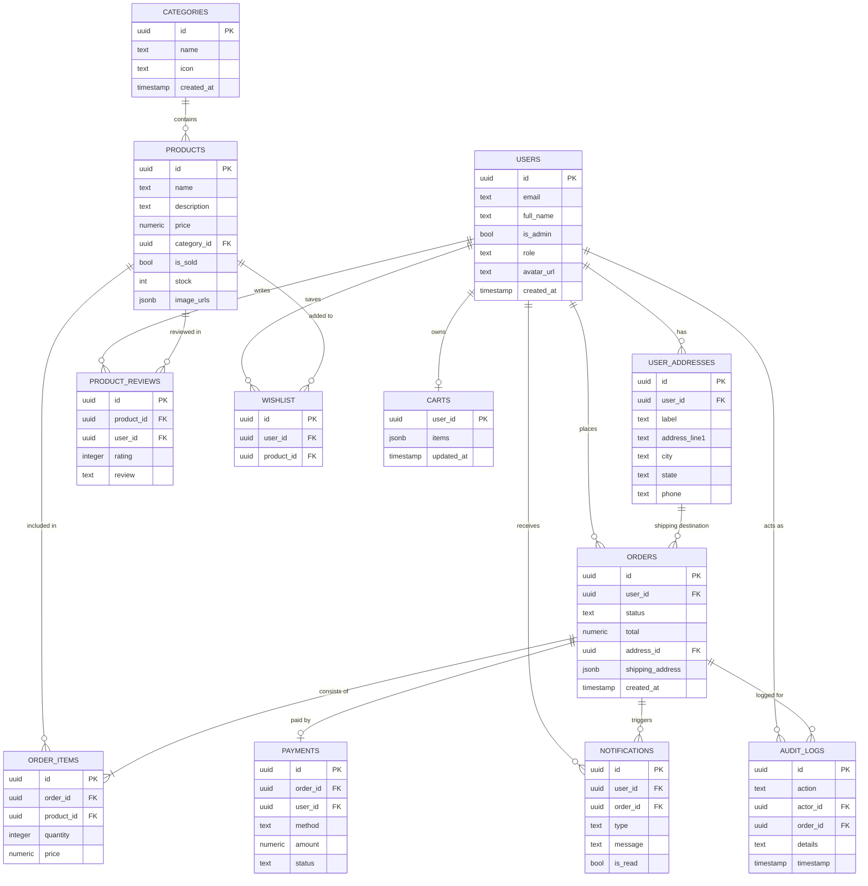

# 🛍️ Mehal Gebeya — Premium Ethiopian E-Commerce

Mehal Gebeya is a high-performance, modern e-commerce application designed specifically for the Ethiopian market. Built with **Flutter** and powered by **Supabase**, it delivers a seamless shopping experience for local users, featuring professional product displays, secure authentication, and a robust administrative backend.

---

## ✨ Key Features

### 🛒 For Customers
*   **Dual Authentication**: Secure login via Supabase Auth and Firebase integration.
*   **Discovery**: Browse diverse categories such as Traditional Clothing, Food, Jewelry, and Handcrafts.
*   **Personalization**: Persistent favorites/wishlist, dark/light mode preferences, and multi-address management.
*   **Smart Cart & Orders**: Real-time cart updates and detailed order tracking with PDF receipt generation.
*   **Localized Payments**: Integrated support for local payment methods (CBE, Telebirr, Chapa).

### 🛡️ For Admins
*   **Modern Dashboard**: Comprehensive analytics and management tools.
*   **Resource Management**: Full CRUD operations for products and categories.
*   **Auditability**: Complete audit logging for critical administrative actions.
*   **Order Fulfillment**: Real-time order management and status tracking.

---

## 🛠️ Technology Stack

| Layer | Technology |
| :--- | :--- |
| **Frontend** | [Flutter 3.x](https://flutter.dev) (Responsive Web & Mobile) |
| **Backend** | [Supabase](https://supabase.com) (Auth, Database, Storage) |
| **State Management** | [Provider](https://pub.dev/packages/provider) |
| **Storage** | Supabase Storage (Avatars, Product Images) |
| **Security** | PostgreSQL Row Level Security (RLS) |
| **Reports** | [PDF Package](https://pub.dev/packages/pdf) for Receipts |

---

## 🏛️ Database Schema

Mehal Gebeya uses a highly relational PostgreSQL schema optimized for e-commerce performance and security.

### 📊 Entity Relationship Diagram



---

## 🚀 Getting Started

### Prerequisites
*   [Flutter SDK](https://flutter.dev/docs/get-started/install) (>= 3.0.0)
*   [Supabase Account](https://supabase.com/)

### Installation

1.  **Clone & Fetch Dependencies**
    ```bash
    git clone [repository-url]
    cd mehal_gebeya
    flutter pub get
    ```

2.  **Configure Environment Variables**
    Create a file at `assets/.env` and add your credentials:
    ```env
    SUPABASE_URL=https://your-project-ref.supabase.co
    SUPABASE_ANON_KEY=your-anon-key
    ```
    *Ensure `assets/.env` is included in your `pubspec.yaml`.*

3.  **Database Setup**
    *   Run the provided `supabase_setup.sql` in your Supabase SQL Editor to create tables.
    *   **CRITICAL**: Run `policy.sql` to apply the secure Row Level Security rules.

4.  **Run the Application**
    ```bash
    flutter run
    ```

---

## 📦 Build & Release

### 📱 Android (APK)
To generate a release build for Android devices:
```bash
flutter build apk --release
```
The output file can be found at: `build/app/outputs/flutter-apk/app-release.apk`

### 🌐 Web
To build the application for hosting on a web server:
```bash
flutter build web --release --base-href "/"
```
The production-ready files will be located in the `build/web/` directory.

---

## 🔒 Database & Security (RLS)

This project uses **PostgreSQL Row Level Security** to ensure data integrity. 
*   **User Privacy**: Users can only access their own profiles, addresses, and orders.
*   **Content Safety**: Only authenticated admins have permission to update products or categories.
*   **Public Access**: Product catalogs and reviews are publicly viewable for maximum conversion.

To re-apply or update security rules, refer to [policy.sql](policy.sql).

---

## 📁 Folder Structure

```text
lib/
├── models/         # Data structures (Order, Product, User)
├── providers/      # State management (Cart, Theme, Auth)
├── screens/        # UI Layers (Auth, Profile, Admin, Shop)
├── services/       # External APIs (Supabase, PDF Export)
├── widgets/        # Reusable UI components
└── main.dart       # App entry & Routing
```

---

## 🔧 Troubleshooting

### ☕ JAVA_HOME / Gradle Errors
If you encounter `JAVA_HOME is set to an invalid directory` when running on Android:
1.  **Direct Flutter Config** (Recommended):
    ```powershell
    flutter config --jdk-dir "C:\Program Files\Eclipse Adoptium\jdk-17.x.x-hotspot"
    ```
2.  **System Environment**:
    Ensure your `JAVA_HOME` environment variable points to a valid JDK path and restart your terminal.

### 🛠️ Persistent Build Errors (Exit 1)
If the build fails unexpectedly after environment changes:
1.  **Clean the project**: `flutter clean`
2.  **Fetch dependencies**: `flutter pub get`
3.  **Run again**: `flutter run`
4.  **Run on web**: flutter run -d chrome --web-port=3000

*Note: If errors persist, try closing any programs that might be locking files (like Antivirus or indexing tools).*

---

## 🎨 Theming

The app supports a premium Dark Mode. Preferences are automatically saved using `SharedPreferences`. Toggle the theme in **Settings > Appearance**.

---

## 📄 License

This project is licensed under the MIT License.
